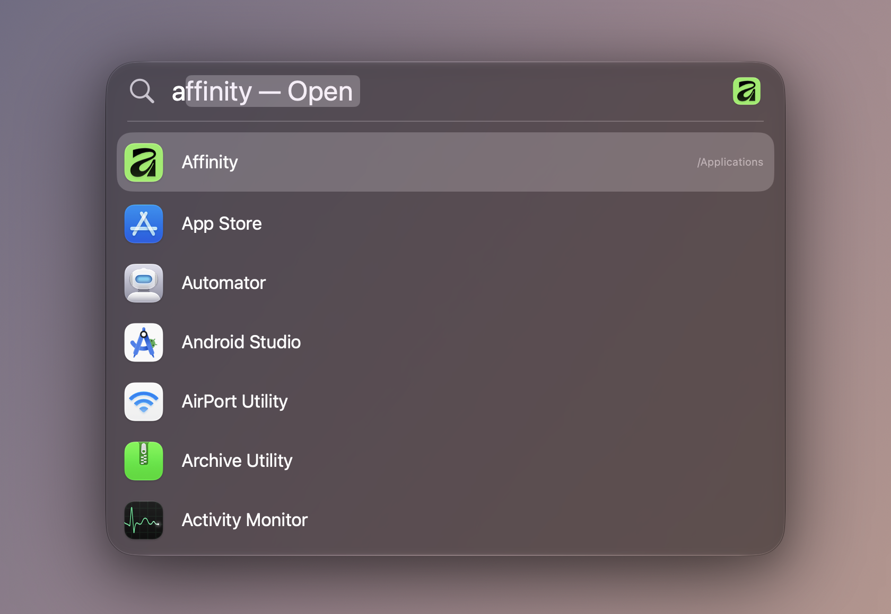

# Spotlite

A lightweight application launcher for macOS 26. Press a shortcut, type a few
letters, hit Return.

Spotlight searches everything on your Mac, which makes it slow to settle and
noisy when all you want is to open an app. Spotlite looks like Spotlight but
only does the launcher part, and stays out of the way until you call it. It
sits at 0% CPU while idle and ranks results in about 28 microseconds per
keystroke.



## Features

- Fuzzy app search: `saf` finds Safari, `gc` finds Google Chrome.
- Apps you launch often rank higher, without taking over queries they match poorly.
- A calculator that shows the result as you type; Return copies it.
- Integer base conversion and offline unit conversion.
- UUID generation, copied straight to the clipboard.
- System Settings panes by name: `blue` opens Bluetooth.
- System commands such as Lock Screen, Sleep, Restart and Empty Trash.
- Links to folders, files or web pages, each with its own name and alias.
- Links with a `{query}` placeholder: press Tab and type to search GitHub or pass text to a Shortcut.
- A web search row (DuckDuckGo, Google or Bing) for when nothing on the Mac matches.
- Aliases, so `ps` opens Photoshop.
- Choose which folders to search for apps.
- Hide apps you never launch with Command-Delete.
- Optional recent apps list before you type, and a dot under apps that are running.
- A Caffeinate switch that keeps the display awake.
- The look of macOS 26 Spotlight, Liquid Glass included, in light and dark mode.

## Install

With Homebrew:

```sh
brew install ivalkenburg/tap/spotlite
xattr -dr com.apple.quarantine /Applications/Spotlite.app
```

Spotlite is not notarized by Apple, so macOS blocks its first launch. The
`xattr` line allows it. You can also open it once and click "Open Anyway" in
System Settings › Privacy & Security.

### Build from source

You need macOS 26 and Xcode 26.

```sh
git clone https://github.com/ivalkenburg/spotlite.git
cd spotlite
make install
```

This builds the app and copies it to `/Applications`. "Start at login" only
works from there.

## Usage

| Key | Action |
| --- | --- |
| `Option-Space` | Show or hide the launcher (configurable) |
| `Up` / `Down` | Move the selection |
| `Return` | Open the selected result, or copy a calculator result |
| `Tab` | Type input for the selected `{query}` link |
| `Command-1` to `Command-9` | Open the nth result |
| `Command-Return` | Reveal the selected app or file in Finder |
| `Option-Return` | Copy the selected app's path or link's address |
| `Command-Q` | Quit the selected app if it is running |
| `Command-Delete` | Hide the selected app from results |
| `Escape` | Close |

Open Settings from the menu bar icon, or search for `settings` in Spotlite.
Drag the panel's edges to resize it, or drag an empty part of the search bar to
move it up or down.

## Permissions

Searching and launching need no permissions, not even Accessibility. Restart,
Shut Down, Log Out, Empty Trash and Toggle Dark Mode send Apple events to
loginwindow, Finder or System Events, and macOS asks you once per app to allow
it under Privacy & Security › Automation.

## License

MIT. See [LICENSE](LICENSE).
