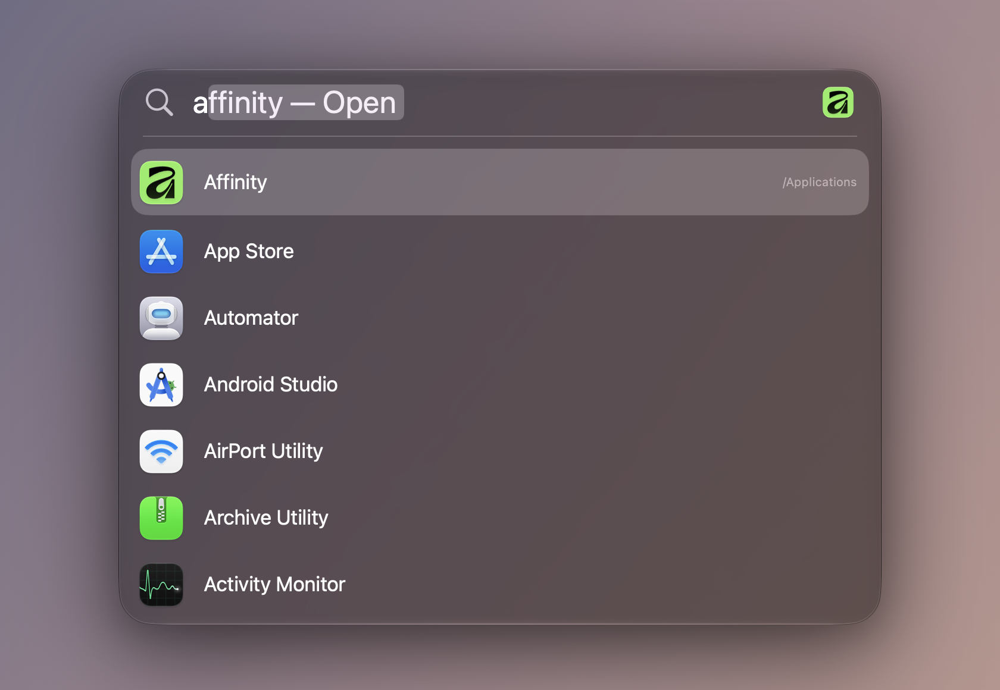

# Spotlite

A lightweight application launcher for macOS 26. Press a shortcut, type a few
letters, hit return.

It exists because a launcher should be invisible until you need it: Spotlite sits
at 0% CPU while idle and does its matching and ranking in about 28 microseconds per
keystroke.



## Features

- **Fuzzy app search.** Bonus-weighted subsequence matching, so `saf` finds Safari
  and `gc` finds Google Chrome.
- **Frecency ranking.** Apps you launch often rank higher, but the boost is capped
  so a familiar app can never hijack a query it doesn't match well.
- **Built-in calculator.** Type an expression and the result appears on a card at
  the top. Return copies it to the clipboard.
- **Hide apps you never launch.** Command-Delete on a result hides it; the full
  list with checkboxes lives in Settings.
- **Aliases.** Teach it that `ps` means Photoshop. An alias always outranks an
  incidental name match, and works even when the name shares no letters with it.
- **Caffeinate.** Search for it to get a row with a switch that keeps the display
  awake. The switch also reflects display-sleep assertions from other apps and
  `/usr/bin/caffeinate`; externally owned assertions are shown read-only. A separate
  filled-cup menu-bar item appears only while caffeine is active, leaving Spotlite's
  normal search icon unchanged and remaining visible when that icon is disabled.
- **Looks like Spotlight.** The panel matches macOS 26 Spotlight's layout, colours
  and animations, measured from side-by-side captures in both themes: untinted
  Liquid Glass (`NSGlassEffectView`), an inline completion after the query
  (`saf` + `ari — Open`), the selected result's icon at the bar's end, a soft
  highlight on the top hit that turns accent blue once you use the arrow keys.

## Requirements

macOS 26.0 or later. Xcode 26 to build.

## Install

```sh
git clone https://github.com/ivalkenburg/spotlite.git
cd spotlite
make install
```

`make` builds a signed `Spotlite.app` into `./build`. `make install` copies it to
`/Applications`, which is where it needs to live before you enable "Start at
login". Spotlite disables that option when it is running elsewhere so a login
item cannot point into a build directory that may later be cleaned.

On first launch Spotlite opens its Settings window once to show you the shortcut.
It does not add itself as a login item unless you ask it to.

## Usage

| Key | Action |
| --- | --- |
| `Option-Space` | Show or hide the launcher (configurable) |
| `Up` / `Down` | Move the cursor, wrapping at both ends |
| `Return` | Launch the selected app, or copy a calculator result |
| `Backspace` | First removes the completion, then deletes as usual |
| `Command-1` to `Command-9` | Launch the nth result directly |
| `Command-Return` | Reveal the selected app in Finder |
| `Option-Return` | Copy the selected app's path |
| `Command-Q` | Quit the selected app, if it is running |
| `Command-Delete` | Hide the selected app from results |
| `Escape` | Close |

Clicking outside the window closes it. Hovering does not move the cursor, so an
incidental mouse position can never change what Return does. The selected row
shows where the app lives, which tells two copies of the same app apart. Holding
Command or Option swaps that path for what those modifiers do.

By default the panel opens on whichever display holds the pointer. Settings can
pin it to the main display instead. Appearance can follow the system or stay in
light or dark mode.

The panel can be resized by dragging either edge, and moved up or down by
dragging an empty part of the search bar. It stays locked to the horizontal
centre of the screen, so it only ever travels vertically. Because it stays
centred, the width changes by twice the pointer movement — the edge you are
holding stays under the pointer. There is no visible handle: the cursor changes
when you are over an edge. "Reset Size & Position" in Settings puts it back.

Width is stored in points and vertical position as a fraction of screen height,
so the panel lands in the same visual place on any display. Geometry that does
not fit the current screen is clamped when the panel is placed, never written
back — unplugging a monitor will not destroy the setting.

To reach Settings, use the menu bar icon, or search for `settings` in Spotlite
itself. Spotlite indexes its own Settings entry, so it stays reachable even with
the menu bar icon turned off.

## Permissions

None. The global shortcut uses Carbon's `RegisterEventHotKey`, which needs no
Accessibility access and is dispatched by the window server rather than waking the
process on every keystroke. Spotlite is not sandboxed, because a sandboxed app
cannot launch arbitrary applications.

## How it works

The app index is a depth-2 scan of `/Applications`, `/System/Applications`,
`/System/Applications/Utilities`, `/System/Library/CoreServices/Applications` and
`~/Applications`, skipping background-only agents. Apps are indexed under the
localized name Finder shows, rather than potentially abbreviated internal bundle
metadata. It is cached to
`~/Library/Caches/Spotlite` and refreshed in the background on first use, by an
`FSEventStream` with a 2 second coalescing latency, and by a modification-time
check when the panel opens. Cached results remain immediately available while a
refresh is running.

Preferences and launch history live in `~/Library/Application Support/Spotlite`,
separate from the cache: the index is regenerable, your hidden-app list is not.

Matching runs synchronously on the main thread. Scoring and ranking the whole index
takes about 28 microseconds, so a background queue would add dispatch overhead and
cancellation bugs to save nothing.

Icons are the opposite case, and are loaded on a background queue: only rows that
are actually on screen request one, but a fetch plus its first rasterise costs
roughly 670 microseconds, which is enough to stall a keystroke. Rows show the
generic bundle icon and fade the real one in.

External caffeine state is refreshed when Spotlite launches, when the panel or menu
opens, and after Spotlite toggles its own assertion. A coalescible five-second timer
keeps the independent caffeine indicator current even when the normal Spotlite menu-bar
icon is hidden.

## Development

```sh
make          # build and sign into ./build
make test     # run the test suite
make install  # copy to /Applications
```

The package splits into `SpotliteCore`, which is pure Swift with no AppKit
dependency and holds the matcher, calculator, index and preferences, and
`Spotlite`, which is the AppKit layer. The split keeps the tests headless.

There are a few dev hooks, all off by default:

| Flag | Effect |
| --- | --- |
| `--bench` | Time the matcher against the real index |
| `--search <query>` | Print ranked results with scores |
| `--dump` | Print the index |
| `SPOTLITE_DEV_FRAMES=1` | Dump runtime view frames and exit |
| `SPOTLITE_DEV_PIN=1` | Stop the panel hiding when it loses focus |

`SPOTLITE_DEV_FRAMES` earned its place: several layout bugs were only findable by
comparing real frames against what the layout code claimed, rather than by
reading screenshots.

## Measurements

From the author's machine, indexing 88 applications:

| | |
| --- | --- |
| Match and ranking cost | 28 µs per keystroke across the full index |
| Idle CPU | 0.0% |
| Idle memory | 32 MB, or 45 MB with the menu bar icon enabled |
| After use | ~88 MB, stable across repeated open and close |

Memory after use is higher than the "lightweight" goal really implies. The bulk of
it arrives when the glass panel is first constructed and is most likely the
GPU-backed surfaces behind `NSGlassEffectView`, though that has not been proven.
